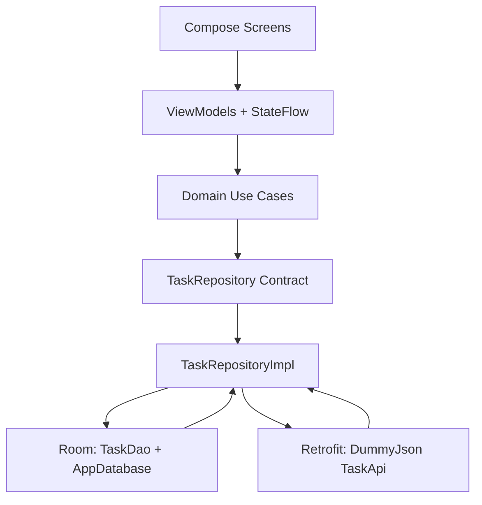

# Task Manager

Task Manager is a production-ready offline-first Android sample built with Kotlin, Jetpack Compose, Material 3, MVVM, Clean Architecture, Hilt, Room, Retrofit, Coroutines, Flow, StateFlow, Repository Pattern, and Use Cases.

## Architecture Diagram



## Folder Structure

```text
com.taskmanager
├── core
│   ├── common        # Result wrapper shared across layers
│   ├── ui            # Material 3 theme
│   └── util          # Date utilities
├── data
│   ├── local         # Room entity, DAO, database, converters
│   ├── remote        # Retrofit API, DTOs, network result wrapper
│   ├── repository    # Offline-first repository implementation
│   └── mapper        # Entity/DTO/domain mappers
├── domain
│   ├── model         # Task and Priority domain models
│   ├── repository    # Repository contract
│   └── usecase       # Business actions
├── presentation
│   ├── dashboard     # Dashboard screen/state/event/viewmodel
│   ├── tasklist      # Task list screen/state/event/viewmodel
│   ├── addtask       # Add task screen/state/event/viewmodel
│   ├── edittask      # Edit task screen/state/event/viewmodel
│   ├── detail        # Detail screen/state/event/viewmodel
│   ├── navigation    # Navigation Compose routes and host
│   └── components    # Reusable Compose components
└── di                # Hilt modules
```

## Features

- Dashboard with total, completed, pending, and progress percentage.
- Task list with search, all/completed/pending filters, refresh action, empty/loading/error states, LazyColumn cards, Scaffold, TopAppBar, FloatingActionButton, and SnackbarHost.
- Add, edit, detail, complete, and delete task flows.
- Offline-first storage using Room Flow as the source of truth.
- Retrofit sync against DummyJson todos.
- Unit tests for repository and ViewModel plus Compose UI tests.

## Build and Test

```bash
./gradlew test
./gradlew connectedAndroidTest
./gradlew assembleDebug
```
